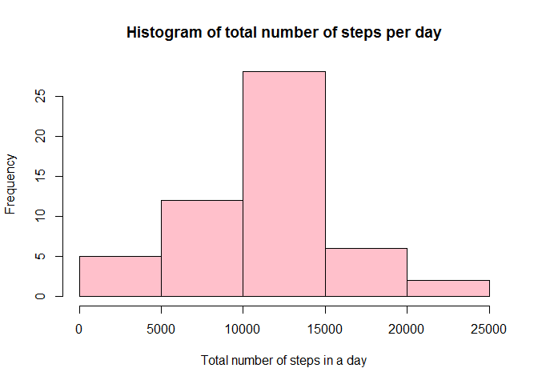
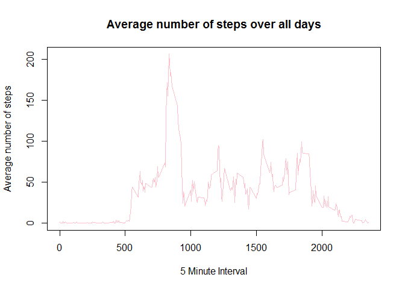
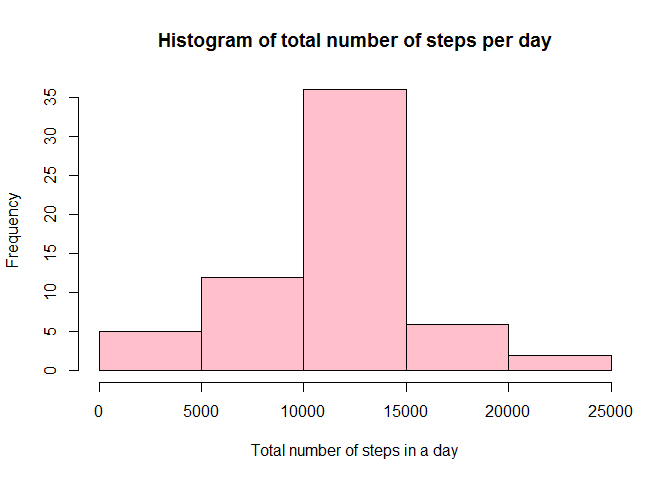
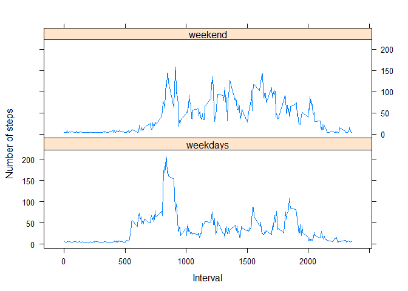

# Reproducible Research: Peer Assessment 1

```r
  library(knitr)
  library(dplyr)
```

```
## 
## Attaching package: 'dplyr'
## 
## The following objects are masked from 'package:stats':
## 
##     filter, lag
## 
## The following objects are masked from 'package:base':
## 
##     intersect, setdiff, setequal, union
```

```r
  library(ggplot2)

  opts_chunk$set(echo=TRUE)
```


##1. Loading and preprocessing the data

```r
unzip('./activity.zip')
raw <- read.csv('activity.csv', colClasses = c("integer", "Date", "integer"))
activity <- raw[ with (raw, { !(is.na(steps)) } ), ]
head(activity,5)
```

```
##     steps       date interval
## 289     0 2012-10-02        0
## 290     0 2012-10-02        5
## 291     0 2012-10-02       10
## 292     0 2012-10-02       15
## 293     0 2012-10-02       20
```

##2. What is mean total number of steps taken per day?
####2.1. Total Number of Steps per day

```r
by_day <- group_by(activity, date)
steps_by_day <- summarise(by_day, total = sum(steps))
t <- nrow(steps_by_day)
summary(steps_by_day)
```

```
##       date                total      
##  Min.   :2012-10-02   Min.   :   41  
##  1st Qu.:2012-10-16   1st Qu.: 8841  
##  Median :2012-10-29   Median :10765  
##  Mean   :2012-10-30   Mean   :10766  
##  3rd Qu.:2012-11-16   3rd Qu.:13294  
##  Max.   :2012-11-29   Max.   :21194
```
There are 53 distinct days in the dataset ranging from 2012-10-02
 to 2012-11-29.

###2.2. Histogram of the total number of steps taken each day

```r
hist(steps_by_day$total, main="Histogram of total number of steps per day",
xlab="Total number of steps in a day", col="pink")
```

 

```r
#Histogram shows the frequency of 1 measure. The commented code is a barplot.
#ggplot(activity, aes(date, steps)) + geom_bar(stat = "identity", colour = "steelblue", fill = #"steelblue", width = 0.7) + labs(title = "Histogram of Total Number of Steps Taken Each Day", x #= "Date", y = "Total number of steps")
```

###2.3.Mean and Median of the total number of steps taken per day

```r
day_mean <- mean(steps_by_day$total)
day_median <- median(steps_by_day$total)
```
The mean steps is 10766.19 and 
the median steps is 10765.00.

##3. What is the average daily activity pattern?
###3.1. Time series plot

```r
steps_by_interval <- aggregate(steps ~ interval, activity, mean)
plot(steps_by_interval$interval, steps_by_interval$steps, type='l',
main="Average number of steps over all days", xlab="5 Minute Interval",
ylab="Average number of steps", col="pink")
```

 

###3.2. Max Interval

```r
max_steps_row <- which.max(steps_by_interval$steps)
m<- steps_by_interval[max_steps_row, ]
```
The maximum interval is 835 where the average number of steps is 206.17.

##4. Imputing missing values
###4.1.The Total Number of rows with NAs 

```r
activity_NA <- sum(is.na(raw))
```
Total NAs = 2304


###4.2. & 4.3. Filling in the missing values in new dataset

```r
#fill NA with the mean
activity2 <- raw
activity2$steps[is.na(activity2$steps)] <- mean(activity2$steps, na.rm = T)
head(activity2, 5) #previous the head would have given NA on steps
```

```
##     steps       date interval
## 1 37.3826 2012-10-01        0
## 2 37.3826 2012-10-01        5
## 3 37.3826 2012-10-01       10
## 4 37.3826 2012-10-01       15
## 5 37.3826 2012-10-01       20
```

###4.4. New Histogram & Statistics

```r
by_day2 <- group_by(activity2, date)
steps_by_day2 <- summarise(by_day2, total = sum(steps))
t <- nrow(steps_by_day2)
summary(steps_by_day2)
```

```
##       date                total      
##  Min.   :2012-10-01   Min.   :   41  
##  1st Qu.:2012-10-16   1st Qu.: 9819  
##  Median :2012-10-31   Median :10766  
##  Mean   :2012-10-31   Mean   :10766  
##  3rd Qu.:2012-11-15   3rd Qu.:12811  
##  Max.   :2012-11-30   Max.   :21194
```

```r
mean(steps_by_day2$total)
```

```
## [1] 10766.19
```

```r
median(steps_by_day2$total)
```

```
## [1] 10766.19
```

```r
hist(steps_by_day2$total, main="Histogram of total number of steps per day",
xlab="Total number of steps in a day", col="pink")
```

 
The first and third quartile changed using my method of filling NAs. 
The mean and median are roughly the same. The histogram frequencies on the mean value
 has now of course increased by the number of NA values from the original data.

##5. Are there differences in activity patterns between weekdays and weekends?
###5.1. A new factor variable in the dataset with two levels - "weekday" and "weekend"

```r
activity2$week_part[(weekdays(activity2$date) == "Saturday" | weekdays(activity2$date) == "Sunday")] <- "weekend"
activity2$week_part[!(weekdays(activity2$date) == "Saturday" | weekdays(activity2$date) == "Sunday")] <- "weekdays"
table(activity2$week_part)
```

```
## 
## weekdays  weekend 
##    12960     4608
```

###5.2. Panel plot containing a time series plot

```r
avgSteps <- aggregate(activity2$steps, 
                      list(interval = as.numeric(as.character(activity2$interval)), 
                           week_part = activity2$week_part),
                      FUN = "mean")
names(avgSteps)[3] <- "meanOfSteps"
library(lattice)
xyplot(avgSteps$meanOfSteps ~ avgSteps$interval | avgSteps$week_part, 
       layout = c(1, 2), type = "l", 
       xlab = "Interval", ylab = "Number of steps")
```

 
